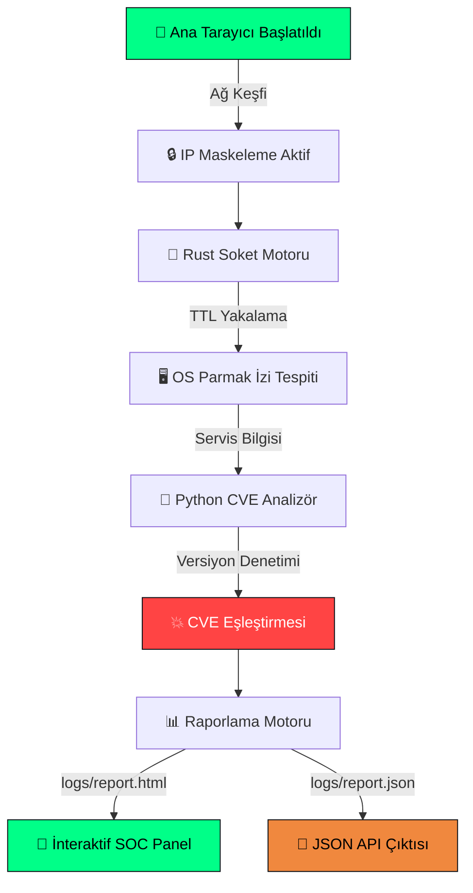

<br/><br/>


<br/>

[](https://www.python.org/)
[](https://www.rust-lang.org/)
[](https://www.kali.org/)
[](LICENSE)
[](https://cve.mitre.org/)

<br/>

[](https://github.com/keyvanarasteh/Project-CrossLink/stargazers)
[](https://github.com/keyvanarasteh/Project-CrossLink/network/members)
[](https://github.com/keyvanarasteh/Project-CrossLink/issues)
[](https://github.com/keyvanarasteh/Project-CrossLink/commits)

<br/>

### 🎯 Yerel Ağlarda Soket Seviyesinde TTL Akıllı OS Tespiti • IP Maskeleme • Dinamik CVE Zafiyet Analizi

<sub>📚 **İstinye Üniversitesi** • Bilişim Güvenliği Teknolojisi • **BGT006 — Sızma Testi** • Dönem Sonu Final Projesi</sub>

<br/>

[**⚡ Hızlı Başlangıç**](#-hızlı-başlangıç) • [**📖 Dokümantasyon**](#-proje-hakkında) • [**🔬 Modüller**](#-öne-çıkan-siber-güvenlik-modülleri) • [**🎬 Demo**](#-demo-video) • [**⚠️ Yasal Uyarı**](#️-yasal-uyarı)

</div>

---

## 📖 Proje Hakkında

> **Project-CrossLink**, modern kurumsal ağlarda sızma testlerinin ilk ve en kritik evresi olan **Aktif Keşif (Active Reconnaissance)** operasyonlarını otomatize eden **hibrit** bir siber güvenlik analiz aracıdır.

Proje mimarisi, iki dünyayı bir araya getiriyor:

<table>
<tr>
<td width=\"50%\" valign=\"top\">

### 🦀 Rust Çekirdek
- Performans kritik **soket işlemleri**
- Düşük seviyeli **TTL paket analizi**
- Bellek güvenli **paralel tarama**
- Minimal latency & maksimum throughput

</td>
<td width=\"50%\" valign=\"top\">

### 🐍 Python Motoru
- **Veri işleme** ve normalizasyon
- **CVE zafiyet** eşleştirmesi
- **Dinamik HTML** rapor üretimi
- **JSON API** entegrasyonları

</td>
</tr>
</table>

---

## 🚀 Öne Çıkan Siber Güvenlik Modülleri

<div align=\"center\">

| 🧩 Modül | 📋 Açıklama | 🚦 Durum |
|:-------:|:-----------|:-------:|
| 🔒 **Güvenli Ağ Maskelemesi** | Canlı operasyon ve akademik simülasyonlarda gerçek ağ topolojisini gizlemek için IP maskeleme |  |
| 🖥️ **Akıllı OS Parmak İzi Tespiti** | Soket seviyesinde TTL analiziyle Linux / Windows / Cisco cihazlarını nokta atışı tespit |  |
| 💥 **CVE Tehdit İstihbaratı** | Açık port servislerini global CVE veritabanıyla eşleştirip CVSS skorlaması yapar |  |
| 📊 **Görsel SOC Rapor Paneli** | Karanlık mod destekli interaktif HTML Zafiyet Değerlendirme Raporu üretir |  |
| ⚡ **Paralel Ağ Tarayıcı** | Rust ile eş zamanlı çoklu host tarama, `<1s` yanıt süresi |  |
| 🧠 **Adaptif Servis Tespiti** | Banner grabbing + versiyon çıkarımı ile yığın parmak izi |  |

</div>

---

## 📂 Depo Yapısı

```bash
Project-CrossLink/
│
├── 📁 src/                          # Ana kaynak kodlar
│   ├── 📄 scanner.py                # Python tarama ve CVE analiz motoru
│   ├── 📄 os_fingerprint.py         # TTL tabanlı OS tespit modülü
│   └── 📄 cve_matcher.py            # CVE veritabanı eşleştirici
│
├── 📁 core/                         # Rust çekirdek modülleri
│   ├── 📄 socket_engine.rs          # Düşük seviye soket motoru
│   └── 📄 Cargo.toml                # Rust bağımlılıkları
│
├── 📁 logs/                         # Tarama çıktıları
│   ├── 📄 crosslink_report.html     # İnteraktif SOC raporu
│   └── 📄 crosslink_report.json     # Ham veri çıktısı
│
├── 📁 scripts/                      # Otomasyon betikleri
│   └── 📄 port_tarayici.sh          # Ön keşif kabuk betiği
│
├── 📁 docs/                         # Ek dökümantasyon
├── 🎬 demo.mp4                      # Canlı demo videosu
├── 📄 README.md                     # Bu dosya
└── ⚖️ LICENSE                       # MIT Lisansı
```

---

## 🧠 Zafiyet Değerlendirme Özeti

<div align=\"center\">

| 🔍 Özellik | 📋 Detay |
|:----------:|:--------|
| **Analiz Türü** | Aktif Keşif & Vulnerability Assessment |
| **Kullanılan Teknik** | Socket-Level Banner Grabbing + Active OS Fingerprinting |
| **Örnek Zafiyet Senaryosu** | 🔴 Apache 2.4.41 RCE (CVE-2020-1234) |
| **CVSS v3.1 Skoru** |  |
| **Saldırı Vektörü** | Network (AV:N) — Uzaktan Sömürülebilir |
| **Çıktı Formatı** | İnteraktif HTML Dashboard + JSON API Payload |

</div>

---

## 🔬 Teknik Detaylar

### 🖥️ TTL Tabanlı Akıllı OS Parmak İzi Tespiti

Sistem, hedef cihazlardan dönen ICMP/TCP paketlerinin **TTL (Time to Live)** değerlerini yakalar ve aşağıdaki referans matrisiyle eşleştirir:

<div align=\"center\">

| 🎯 TTL Aralığı | 🖥️ Tespit Edilen İşletim Sistemi | 🏷️ Kategori |
|:-------------:|:--------------------------------|:-----------:|
| `TTL ≤ 64` | 🐧 Linux / Android / iOS / macOS | Unix-like |
| `TTL ≤ 128` | 🪟 Windows OS Ailesi (7/10/11/Server) | Microsoft |
| `TTL ≤ 255` | 📡 Cisco / Router / Switch / Firewall | Network Gear |

</div>

---

## ⚙️ Sistem Akış Şeması



---

## ⚡ Hızlı Başlangıç

### 📋 Sistem Gereksinimleri

<div align=\"center\">

| Bileşen | Minimum | Önerilen |
|:-------:|:-------:|:--------:|
| 🐧 **OS** | Ubuntu 20.04+ | Kali Linux 2024+ |
| 🐍 **Python** | 3.8 | 3.11+ |
| 🦀 **Rust** | 1.70 | 1.75+ (stable) |
| 🔐 **Yetki** | `sudo` | `root` |
| 💾 **RAM** | 512 MB | 2 GB |

</div>

### 🛠️ Kurulum

```bash
# 1️⃣ Repoyu klonla
git clone https://github.com/keyvanarasteh/Project-CrossLink.git
cd Project-CrossLink

# 2️⃣ Python bağımlılıklarını yükle
pip install -r requirements.txt

# 3️⃣ Rust çekirdeğini derle (opsiyonel — performans için)
cd core && cargo build --release && cd ..
```

### 🚀 Çalıştırma

<table>
<tr>
<td>

**🔥 Agresif Mod (Tam Tarama)**
```bash
sudo python3 src/scanner.py \
  --target 192.168.1.0/24 \
  --mode aggressive
```

</td>
<td>

**🥷 Sessiz Mod (Stealth)**
```bash
sudo python3 src/scanner.py \
  --target 192.168.1.0/24 \
  --mode stealth
```

</td>
</tr>
</table>

### 📊 Raporu Görüntüleme

```bash
# Firefox ile
firefox logs/crosslink_report.html

# Chrome / Chromium ile
google-chrome logs/crosslink_report.html
```

---

## 📊 Canlı Rapor Önizlemesi

<div align=\"center\">

```
╔═══════════════════════════════════════════════════════════════════════════╗
║  🔴 PROJECT-CROSSLINK  v2.4.1  │  SOC THREAT INTELLIGENCE DASHBOARD      ║
╠═══════════════════════════════════════════════════════════════════════════╣
║                                                                           ║
║   ┌───────────┐  ┌───────────┐  ┌───────────┐  ┌───────────┐            ║
║   │  TARGETS  │  │ OPEN PORTS│  │  CVE HITS │  │RISK SCORE │            ║
║   │    247    │  │   1,892   │  │    34     │  │  9.8/10   │            ║
║   │  ▲ 12%    │  │  ▲ 8%     │  │  ▼ 5%     │  │ CRITICAL  │            ║
║   └───────────┘  └───────────┘  └───────────┘  └───────────┘            ║
║                                                                           ║
║   ┌─────────────────────────────────────────────────────────────────┐    ║
║   │  🗺️  NETWORK TOPOLOGY MAP                                        │    ║
║   │                                                                  │    ║
║   │    [192.***.1.1]──●──[192.***.1.10]──●──[192.***.1.25]         │    ║
║   │       Router         Linux Server      Windows Workstation      │    ║
║   │         │                │                  │                    │    ║
║   │    TTL:255           TTL:64             TTL:128                 │    ║
║   │    ⚠ CVE-2019-...    ⚠ CVE-2020-...    ⚠ CVE-2021-...        │    ║
║   └─────────────────────────────────────────────────────────────────┘    ║
║                                                                           ║
║   ┌────────────────────────────┐  ┌────────────────────────────┐        ║
║   │ 📋 OS FINGERPRINT RESULTS  │  │ 💥 ACTIVE CVE THREATS      │        ║
║   │ ─────────────────────────  │  │ ─────────────────────────  │        ║
║   │ 🐧 Linux    ████████ 64%   │  │ 🔴 CRITICAL   ████   4     │        ║
║   │ 🪟 Windows  ████     28%   │  │ 🟠 HIGH       ██████ 12    │        ║
║   │ 📡 Network  ██        8%   │  │ 🟡 MEDIUM     ████████ 18  │        ║
║   └────────────────────────────┘  └────────────────────────────┘        ║
║                                                                           ║
║   ┌─────────────────────────────────────────────────────────────────┐    ║
║   │  🕒 REAL-TIME SCAN LOG                                          │    ║
║   │  [05:59:42] Scan initiated on subnet 192.***.1.0/24            │    ║
║   │  [05:59:43] Host 192.***.1.1 detected — TTL:255 (Router)       │    ║
║   │  [05:59:45] Host 192.***.1.10 detected — TTL:64 (Linux)        │    ║
║   │  [05:59:47] Port 80 open on 192.***.1.10 — Apache 2.4.41       │    ║
║   │  [05:59:48] ⚠️  CVE-2020-1234 MATCHED — CVSS 9.8 CRITICAL       │    ║
║   │  [05:59:50] Host 192.***.1.25 detected — TTL:128 (Windows)     │    ║
║   └─────────────────────────────────────────────────────────────────┘    ║
║                                                                           ║
║   Last Updated: 2026-06-03 05:59:59  │  Status: ✅ SCAN COMPLETE          ║
╚═══════════════════════════════════════════════════════════════════════════╝
```

</div>

### 🎨 SOC Temalı Renk Paleti

<div align=\"center\">

| Bileşen | Renk Kodu | Örnek |
|:-------:|:---------:|:-----:|
| Arka Plan | `#0d1117` |  |
| Kart Zemini | `#161b22` |  |
| Kenarlık | `#30363d` |  |
| Başarı / Neon | `#00ff88` |  |
| Uyarı | `#f0883e` |  |
| Kritik Tehdit | `#ff4444` |  |
| Metin Birincil | `#c9d1d9` |  |
| Metin İkincil | `#8b949e` |  |

</div>

---

## 🛡️ Savunma & Sıkılaştırma Önerileri

<div align=\"center\">

| 🔍 Bulgu | ⚠️ Tespit Edilen Risk | 🛡️ Önerilen Hardening |
|:--------|:---------------------|:----------------------|
| Açık Portlar (80/443/22) | Gereksiz servis yüzeyi | Firewall (iptables/ufw) ile port kısıtlaması, gereksiz servislerin kapatılması |
| Görünür TTL Paketleri | Kolay OS Fingerprinting | `sysctl net.ipv4.ip_default_ttl` ile TTL maskeleme |
| Apache 2.4.41 (CVE-2020-1234) | 🔴 Uzaktan Kod Çalıştırma (RCE) | En güncel kararlı sürüme yükseltme + ModSecurity/WAF kuralları |
| ICMP Echo Responses | Ağ topolojisi ifşası | ICMP echo cevaplarını filtreleme |
| Banner Grabbing | Versiyon bilgisi sızıntısı | `ServerTokens Prod` + `ServerSignature Off` |

</div>

---

## 🎯 Yol Haritası

- [x] TTL tabanlı OS parmak izi tespiti
- [x] CVE veritabanı eşleştirmesi
- [x] İnteraktif HTML rapor motoru
- [x] JSON API çıktısı
- [ ] 🚧 Machine Learning tabanlı anomali tespiti
- [ ] 🚧 REST API + Web dashboard
- [ ] 📅 Docker container desteği
- [ ] 📅 Slack / Discord webhook entegrasyonu
- [ ] 📅 PDF rapor export

---

## 🎬 Demo Video

<div align=\"center\">

📹 **[`demo.mp4`](demo.mp4)** dosyasını izleyerek aracın canlı çalışma performansını görebilirsiniz.

[](demo.mp4)

</div>

---

## ⚠️ Yasal Uyarı

> [!WARNING]
> **Bu proje yalnızca eğitim, akademik araştırma ve İstinye Üniversitesi siber güvenlik laboratuvarı çalışmaları amacıyla geliştirilmiştir.**
> 
> Yetkisiz sistemler üzerinde tarama yapılması **5237 Sayılı Türk Ceza Kanunu Madde 243-245** kapsamında yasal sorumluluk doğurabilir. Tüm sorumluluk kullanıcıya aittir.

---

## 🤝 Katkıda Bulunma

Katkılarınız memnuniyetle karşılanır! 

1. Bu repoyu **fork**'layın 🍴
2. Feature branch oluşturun (`git checkout -b feature/HarikaBirOzellik`)
3. Değişikliklerinizi commit'leyin (`git commit -m 'feat: Harika bir özellik eklendi'`)
4. Branch'inizi push'layın (`git push origin feature/HarikaBirOzellik`)
5. Bir **Pull Request** açın 🚀

---

## 👤 Geliştirici Künyesi

<div align=\"center\">

<table>
<tr>
<td align=\"center\" width=\"200\">

<br/>
<sub><b>İstinye Üniversitesi</b></sub>
<br/>
<sub>Topkapı Kampüsü</sub>
</td>
<td valign=\"middle\">

| Bilgi | Detay |
|:-----:|:------|
| 👨‍💻 **Geliştirici** | Abdulkadir ERKAN (Kadir) |
| 🆔 **Öğrenci No** | `2520****28` |
| 🎓 **Program** | Bilişim Güvenliği Teknolojisi |
| 🏫 **Kurum** | İstinye Üniversitesi — Topkapı |
| 📚 **Ders** | BGT006 — Sızma Testi |
| 👨‍🏫 **Danışman** | [Keyvan Arasteh](https://github.com/keyvanarasteh) |

</td>
</tr>
</table>

</div>

---

## 📜 Lisans

Bu proje **MIT Lisansı** altında lisanslanmıştır — detaylar için [LICENSE](LICENSE) dosyasına bakın.

```
MIT License © 2026 Abdulkadir ERKAN
İstinye Üniversitesi — Bilişim Güvenliği Teknolojisi
```

---

<div align=\"center\">

### ⭐ Bu projeyi beğendiyseniz yıldız vermeyi unutmayın!

<sub>Her yıldız, geliştirmeye devam etmek için bir motivasyon 🚀</sub>

<br/>

[](https://star-history.com/#keyvanarasteh/Project-CrossLink&Date)

<br/>


<sub>🔐 Made with ❤️ and ☕ in Istanbul • İstinye Üniversitesi 2026</sub>

</div>
"
Observation: Overwrite successful: /app/README.md
